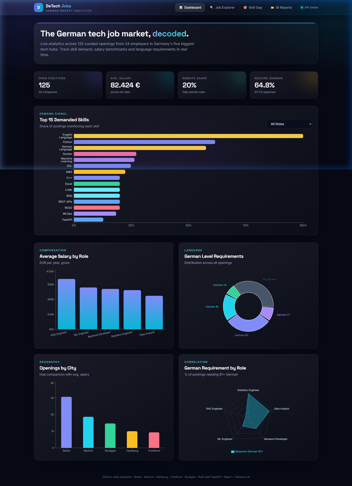
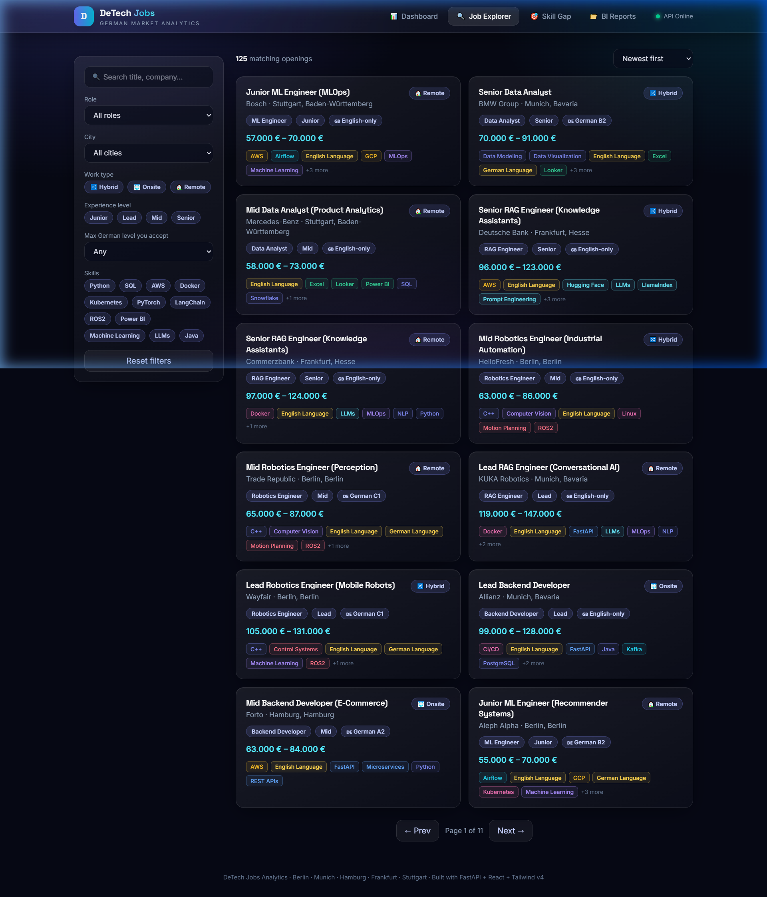
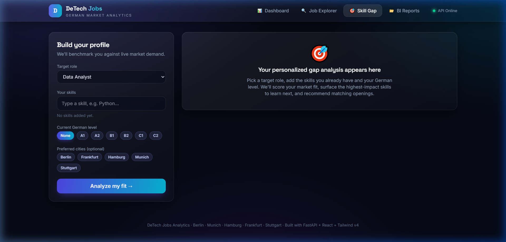
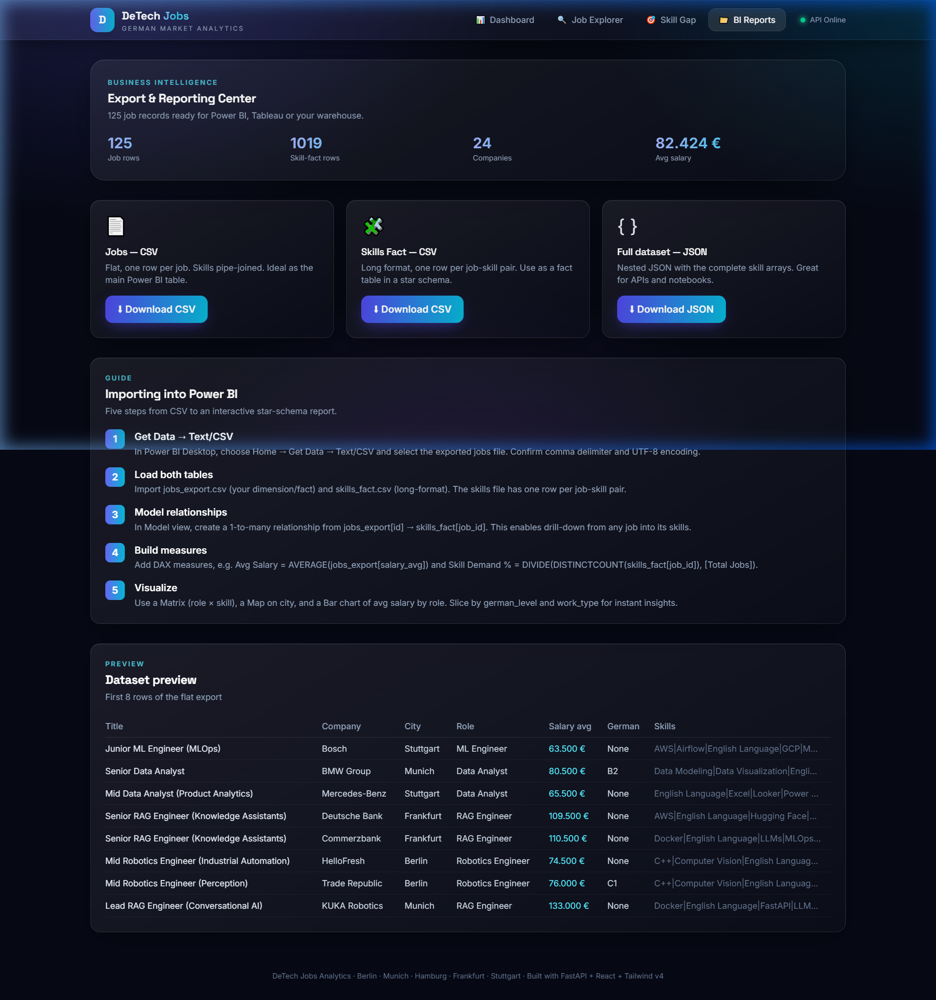
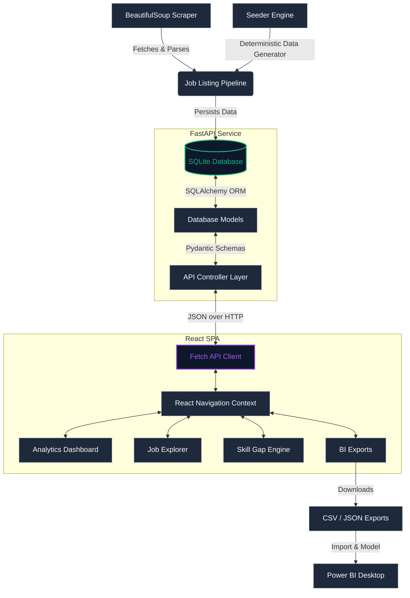

# DeTech Jobs Analytics 🇩🇪

[](https://fastapi.tiangolo.com)
[](https://react.dev)
[](https://vitejs.dev)
[](https://tailwindcss.com)
[](https://sqlite.org)
[](https://www.crummy.com/software/BeautifulSoup/)

**DeTech Jobs Analytics** is a premium, full-stack job market intelligence platform analyzing opportunities across Germany's major tech hubs (**Berlin, Munich, Hamburg, Frankfurt, Stuttgart**). It is built to bridge the gap between job listings and candidates by calculating demand-weighted skill alignments and assessing language proficiency.

The system features a **FastAPI + SQLAlchemy** backend, a **React + Tailwind v4 + Recharts** dark glassmorphism dashboard, and a modular **BeautifulSoup4** scraper pipeline.

---

## 🎨 Application Showcase

Explore the interactive interface of DeTech Jobs Analytics. Click below to expand the screenshot showcases:

<details open>
  <summary>📊 <b>Interactive BI Analytics Dashboard</b></summary>
  <p align="center">
    <br>
    
    <br>
    <i>Displays KPI summaries, top 15 demanded skills filterable by role, salary distributions, geographic job density, and CEFR German language requirements.</i>
  </p>
</details>

<details>
  <summary>🔍 <b>Advanced Job Explorer</b></summary>
  <p align="center">
    <br>
    
    <br>
    <i>Comprehensive job explorer with real-time multi-dimensional filters (Role, City, Work Type, Experience, German Level, and Skill tags) and a detailed job drawer.</i>
  </p>
</details>

<details>
  <summary>🎯 <b>Intelligent Skill-Gap Recommender</b></summary>
  <p align="center">
    <br>
    
    <br>
    <i>Input your current skills and German level to receive a personalized demand-weighted market fit score, a ranked list of missing skills, language alignment recommendations, and target job postings.</i>
  </p>
</details>

<details>
  <summary>📁 <b>BI Reports & Exports Dashboard</b></summary>
  <p align="center">
    <br>
    
    <br>
    <i>Export the aggregated dataset to clean flat CSVs, long skill-fact tables, or nested JSON structures, ready for Star Schema integration in Power BI.</i>
  </p>
</details>

---

## 🏗️ System Architecture & Data Flow

The architecture is designed to split backend computational logic from frontend rendering. The system uses a clean relational database, a robust scraping workflow, and a standardized REST API:



---

## ✨ Features Breakdown

| Module | Core Functionality | Technologies |
| :--- | :--- | :--- |
| **📊 Dashboard** | Real-time charts detailing top-15 demanded skills (per role), average salaries, openings by city, German CEFR levels, and role↔language distribution. | React, Recharts |
| **🔍 Job Explorer** | Paginated board with full-text search and filters for Role, City, Work Type, Experience, Skill tags, and CEFR German language level ceiling. | React, Tailwind v4 |
| **🎯 Recommender** | Skill-gap analyzer calculating a candidate's profile match score weighted by local market demand. Highlights gap skills and gauges German level match. | Python, Pandas/Algorithms |
| **📁 BI Reports** | One-click export for SQLite dataset (flat `jobs` file, long `skills-fact` table, and nested JSON), plus a Power BI import tutorial. | FastAPI File Stream |
| **🕷️ Scraper** | Modular BS4 pipeline (`fetch → parse → extract skills & language → SQL persist`) equipped with an offline mock fixture and live run toggle. | BeautifulSoup4, Requests |

---

## 🚀 Quick Start

Ensure you have **Python 3.11+** and **Node.js 20+** installed.

### 1. Backend Setup (FastAPI)

Clone the repository and install dependencies inside a virtual environment:

```bash
cd backend
python -m venv .venv

# Activate Virtual Environment:
# On Windows (PowerShell):
.\.venv\Scripts\Activate.ps1
# On macOS/Linux:
source .venv/bin/activate

pip install -r requirements.txt
```

#### Seed the Database
Seed the local SQLite database (`detech_jobs.db`) with **125 realistic job postings** and **24 German employers**:
```bash
python -m app.seed
```

#### Run the Server
Launch the backend server locally on port 8000:
```bash
uvicorn app.main:app --port 8000 --reload
```
* **Interactive API Documentation (Swagger)**: http://localhost:8000/docs
* **Alternative Documentation (ReDoc)**: http://localhost:8000/redoc

---

### 2. Frontend Setup (React + Vite)

In a new terminal window, navigate to the frontend folder and install npm dependencies:

```bash
cd frontend
npm install
npm run dev
```

* Open the local application in your browser: http://localhost:5173
* *Note: The Vite development server automatically proxies backend `/api/*` traffic to the FastAPI server at `http://localhost:8000`.*

---

## 🧩 API Reference

The backend exposes the following endpoints to serve the client and export data:

| Method | Endpoint | Description |
| :--- | :--- | :--- |
| `GET` | `/api/health` | Service status check |
| `GET` | `/api/jobs` | Retrieve paginated job listings with multi-filter query support |
| `GET` | `/api/jobs/filters` | Get all active categories (cities, roles, max salary, skill list) for frontend filters |
| `GET` | `/api/jobs/{id}` | Retrieve details of a single job opening |
| `GET` | `/api/analytics/overview` | Fetch high-level platform KPI counts (positions, companies, avg salary) |
| `GET` | `/api/analytics/skill-demand` | Top-demanded skills grouped by role |
| `GET` | `/api/analytics/salary-by-role` | Min/Max/Avg salary analysis for each role |
| `GET` | `/api/analytics/geo` | Openings count and average salary per city |
| `GET` | `/api/analytics/language-demand` | Distribution of job openings by CEFR German levels |
| `GET` | `/api/analytics/role-language` | Radar-chart-ready CEFR distribution metrics per role |
| `GET` | `/api/recommender/roles` | List of supported target roles |
| `POST`| `/api/recommender` | Perform skill-gap evaluation and get jobs recommendations |
| `POST`| `/api/scrape?use_fixture=true` | Execute the BeautifulSoup scraping pipeline (fixture-driven or live) |

### 🔍 Request & Response Payloads

<details>
  <summary><b>POST <code>/api/recommender</code> Request Example</b></summary>
  <br>

  ```json
  {
    "target_role": "ML Engineer",
    "skills": ["Python", "SQL", "Docker"],
    "german_level": "A2",
    "preferred_cities": ["Berlin"]
  }
  ```
</details>

<details>
  <summary><b>POST <code>/api/recommender</code> Response Example</b></summary>
  <br>

  ```json
  {
    "target_role": "ML Engineer",
    "match_score": 42.5,
    "have_skills": ["Docker", "Python", "SQL"],
    "missing_skills": [
      {
        "skill": "PyTorch",
        "category": "ML/AI",
        "market_demand_pct": 85.2,
        "importance": "Critical"
      },
      {
        "skill": "Git",
        "category": "DevOps",
        "market_demand_pct": 55.6,
        "importance": "Important"
      }
    ],
    "language_fit": {
      "user_level": "A2",
      "typical_required_level": "B2",
      "is_sufficient": false,
      "message": "This role usually requires B2 German; your current level is A2. This may exclude you from a share of openings.",
      "recommended_action": "Recommended action: progress from A2 towards B2 (e.g. an intensive Business German course)."
    },
    "recommended_jobs": [
      {
        "id": 4,
        "title": "Machine Learning Engineer",
        "company": "DeepDe GmbH",
        "city": "Berlin",
        "work_type": "Hybrid",
        "salary_avg": 82000,
        "match_pct": 60.0,
        "matched_skills": ["Python", "Docker"],
        "missing_skills": ["PyTorch", "Git", "Kubernetes"]
      }
    ],
    "summary": "You have a solid foundation for ML Engineer roles (42.5% demand-weighted match). Highest-impact skills to add next: PyTorch, Git. Mind the language gap: B2 German is typically expected."
  }
  ```
</details>

---

## ⚙️ Technical Details

### 1. Demand-Weighted Recommendation Engine
Rather than evaluating a candidate's fit on raw skill counts, DeTech Jobs Analytics weights each matching skill by its current frequency in active jobs for that role:

$$\text{Weighted Score} = \frac{\sum_{s \in S_{\text{owned}}} P(s \mid \text{Role})}{\sum_{s' \in S_{\text{required}}} P(s' \mid \text{Role})} \times 100$$

Where $P(s \mid \text{Role})$ represents the probability that a job posting for the specified role requires skill $s$. This prevents a candidate from receiving an inflated score by listing peripheral skills while missing critical core technologies (e.g., PyTorch for an ML Engineer).

### 2. Normalized Relational Schema
The database uses a structured schema optimized for aggregation speed:
* **`job_postings`**: Stores flat attributes (Title, Salary, CEFR German Level, Experience, Location).
* **`skills`**: Normalized catalog containing categorizations (e.g., `ML/AI`, `Cloud`, `Programming`).
* **`job_skills`**: Many-to-many junction table to evaluate aggregations (e.g., skill demand % by role category) without heavy text parsing.

---

## 🕷️ Scraping & Seeding Pipeline

To run the BeautifulSoup parser in offline simulation mode (uses a local fixture file with 125 randomized job templates to safeguard network rate limits):
```bash
cd backend
python -m app.scraper
```

For live collection, customize the crawler settings:
1. Open [scraper.py](file:///d:/german%20tech/backend/app/scraper.py).
2. Set `use_fixture = False` within `ScraperConfig` or set live base URLs.
3. Adapt the CSS target selectors inside `parse_job_card()` to match your target job portals.

---

## 📊 Business Intelligence & Star Schema Setup

The **BI Reports** tab allows exporting job market data directly to your local system for analysis in **Power BI**, **Tableau**, or **Excel**.

### Star Schema Architecture
To implement an analytics dashboard in Power BI, build a star schema relationship using the two exported CSV files:

```
          [ job_postings ]  (Dimension)
                 |
                 |  1
                 |  
                 |  N
          [ skills_fact ]   (Fact)
```

1. **`job_postings.csv`** (Dimension Table): Key fields include `id` (Primary Key), `title`, `company`, `city`, `salary_min`, `salary_max`, `german_level`, and `work_type`.
2. **`skills_fact.csv`** (Fact Table): Bridge table for detailed analytics. Key fields include `job_id` (Foreign Key referencing `job_postings.id`), `skill_name`, and `skill_category`.
3. In Power BI, set the relationship direction to **Single (from job_postings to skills_fact)** with a **1-to-many (1:*)** cardinality.

---

## 📂 Project Structure

```
.
├── backend/
│   ├── app/
│   │   ├── main.py            # FastAPI app server configuration, CORS, and lifespan seeder
│   │   ├── database.py        # SQLAlchemy engine configuration and Session local generator
│   │   ├── models.py          # SQLAlchemy models (JobPosting, Skill, job_skills junction)
│   │   ├── schemas.py         # Pydantic v2 validation models
│   │   ├── seed.py            # Seeder engine (generates 125 jobs across 5 roles deterministically)
│   │   ├── scraper.py         # BeautifulSoup4 web parser pipeline
│   │   └── routes/
│   │       ├── jobs.py        # Endpoints for job details, pagination, and multi-filters
│   │       ├── analytics.py   # Aggregations for salary, skills, location, and language
│   │       └── recommender.py # Skill-gap engine logic & job recommender matching
│   └── requirements.txt       # Python backend dependencies
└── frontend/
    ├── src/
    │   ├── App.jsx            # Application root shell, state router, and nav tabs
    │   ├── api.js             # Centralized fetch client handling API communication
    │   ├── index.css          # Tailwind CSS v4 directives & glassmorphic custom theme
    │   ├── main.jsx           # Client entrypoint mounting the React DOM
    │   └── components/
    │       ├── Dashboard.jsx  # Recharts graphs and high-level KPI cards
    │       ├── JobExplorer.jsx# Filter sidebar and paginated job list details
    │       ├── SkillGapRecommender.jsx # Recommender input form and detailed gap analysis
    │       ├── BIReports.jsx  # File downloads and Power BI star-schema guide
    │       └── ui.jsx         # Shared UI components (glowing cards, custom inputs, buttons)
    └── vite.config.js         # Vite configuration with proxy rules routing /api/ to backend
```

---

*Developed for German Tech Job Market Analytics.*
